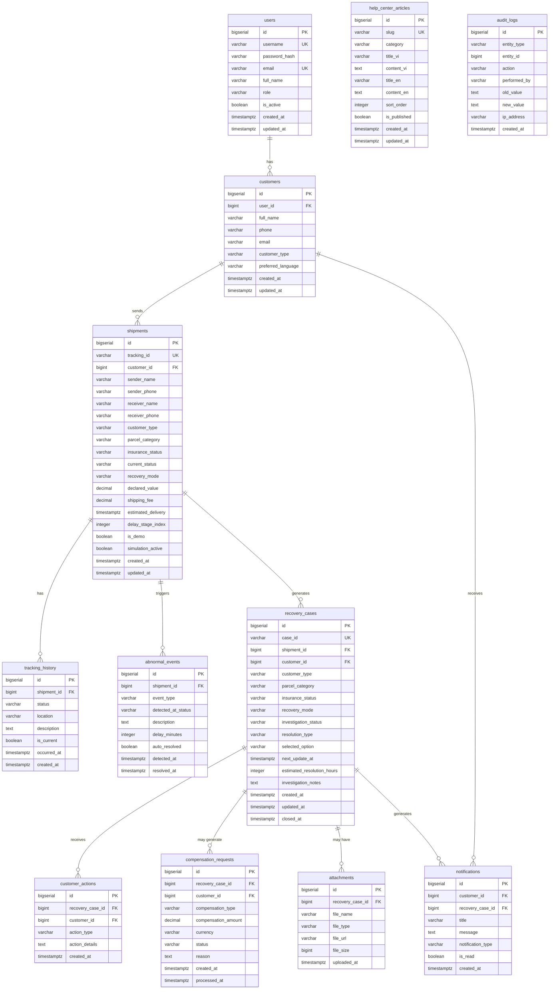

# Smart Adaptive Recovery System (SARS) - Database ERD

```mermaid
erDiagram
    users ||--o{ customers : "has"
    customers ||--o{ shipments : "sends"
    shipments ||--o{ tracking_history : "has"
    shipments ||--o{ abnormal_events : "triggers"
    shipments ||--o{ recovery_cases : "generates"
    recovery_cases ||--o{ customer_actions : "receives"
    recovery_cases ||--o{ compensation_requests : "may generate"
    recovery_cases ||--o{ attachments : "may have"
    recovery_cases ||--o{ notifications : "generates"
    customers ||--o{ notifications : "receives"

    users {
        bigserial id PK
        varchar username UK
        varchar password_hash
        varchar email UK
        varchar full_name
        varchar role
        boolean is_active
        timestamptz created_at
        timestamptz updated_at
    }

    customers {
        bigserial id PK
        bigint user_id FK
        varchar full_name
        varchar phone
        varchar email
        varchar customer_type
        varchar preferred_language
        timestamptz created_at
        timestamptz updated_at
    }

    shipments {
        bigserial id PK
        varchar tracking_id UK
        bigint customer_id FK
        varchar sender_name
        varchar sender_phone
        varchar receiver_name
        varchar receiver_phone
        varchar customer_type
        varchar parcel_category
        varchar insurance_status
        varchar current_status
        varchar recovery_mode
        decimal declared_value
        decimal shipping_fee
        timestamptz estimated_delivery
        integer delay_stage_index
        boolean is_demo
        boolean simulation_active
        timestamptz created_at
        timestamptz updated_at
    }

    tracking_history {
        bigserial id PK
        bigint shipment_id FK
        varchar status
        varchar location
        text description
        boolean is_current
        timestamptz occurred_at
        timestamptz created_at
    }

    abnormal_events {
        bigserial id PK
        bigint shipment_id FK
        varchar event_type
        varchar detected_at_status
        text description
        integer delay_minutes
        boolean auto_resolved
        timestamptz detected_at
        timestamptz resolved_at
    }

    recovery_cases {
        bigserial id PK
        varchar case_id UK
        bigint shipment_id FK
        bigint customer_id FK
        varchar customer_type
        varchar parcel_category
        varchar insurance_status
        varchar recovery_mode
        varchar investigation_status
        varchar resolution_type
        varchar selected_option
        timestamptz next_update_at
        integer estimated_resolution_hours
        text investigation_notes
        timestamptz created_at
        timestamptz updated_at
        timestamptz closed_at
    }

    notifications {
        bigserial id PK
        bigint customer_id FK
        bigint recovery_case_id FK
        varchar title
        text message
        varchar notification_type
        boolean is_read
        timestamptz created_at
    }

    customer_actions {
        bigserial id PK
        bigint recovery_case_id FK
        bigint customer_id FK
        varchar action_type
        text action_details
        timestamptz created_at
    }

    compensation_requests {
        bigserial id PK
        bigint recovery_case_id FK
        bigint customer_id FK
        varchar compensation_type
        decimal compensation_amount
        varchar currency
        varchar status
        text reason
        timestamptz created_at
        timestamptz processed_at
    }

    attachments {
        bigserial id PK
        bigint recovery_case_id FK
        varchar file_name
        varchar file_type
        varchar file_url
        bigint file_size
        timestamptz uploaded_at
    }

    help_center_articles {
        bigserial id PK
        varchar slug UK
        varchar category
        varchar title_vi
        text content_vi
        varchar title_en
        text content_en
        integer sort_order
        boolean is_published
        timestamptz created_at
        timestamptz updated_at
    }

    audit_logs {
        bigserial id PK
        varchar entity_type
        bigint entity_id
        varchar action
        varchar performed_by
        text old_value
        text new_value
        varchar ip_address
        timestamptz created_at
    }
```
