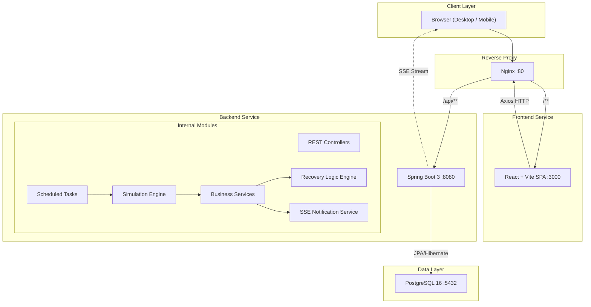
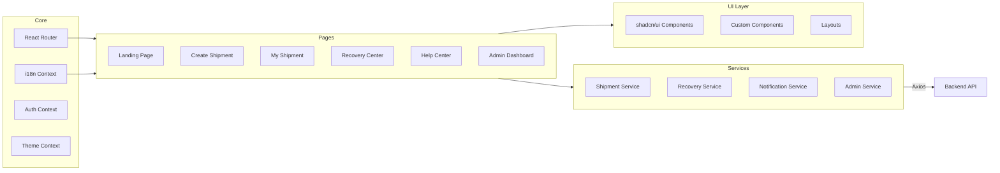
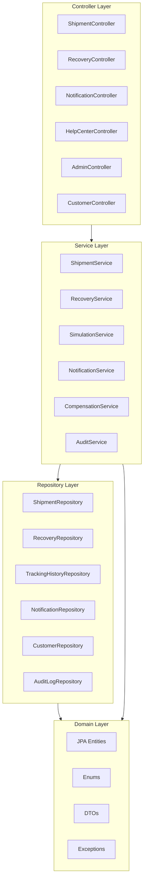
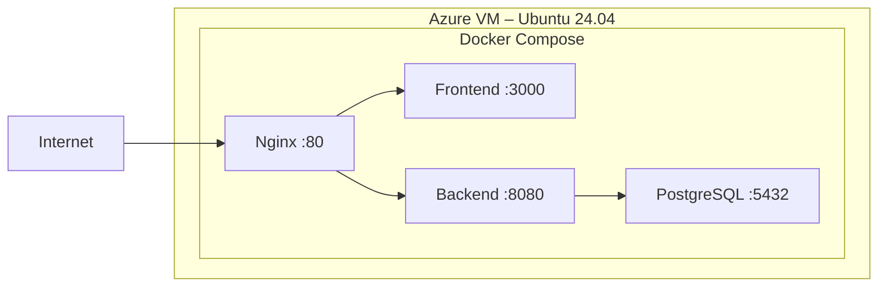

# System Architecture

## Overview

The Smart Adaptive Recovery System (SARS) follows a **modular monolith** architecture with a clear separation between frontend (SPA), backend (REST API), and database layers. All services are containerized and orchestrated via Docker Compose behind an Nginx reverse proxy.

---

## High-Level Architecture



---

## Component Architecture

### Frontend Architecture



### Backend Architecture (Layered)



---

## Backend Package Structure

```
com.viettelpost.sars/
├── SarsApplication.java              # Main application entry point
├── config/
│   ├── WebConfig.java                 # CORS, SSE configuration
│   ├── SecurityConfig.java            # Spring Security configuration
│   └── SchedulerConfig.java           # Async & scheduling configuration
├── controller/
│   ├── ShipmentController.java        # Shipment CRUD & tracking
│   ├── RecoveryController.java        # Recovery case management
│   ├── NotificationController.java    # SSE endpoint & notification history
│   ├── HelpCenterController.java      # Help center articles & policies
│   ├── AdminController.java           # Admin dashboard APIs
│   └── CustomerController.java        # Customer management
├── service/
│   ├── ShipmentService.java           # Shipment business logic
│   ├── SimulationService.java         # Shipment progression simulation
│   ├── DelayDetectionService.java     # Abnormal delay detection engine
│   ├── RecoveryService.java           # Recovery case lifecycle
│   ├── RecoveryStrategyService.java   # Adaptive recovery strategy resolver
│   ├── CompensationService.java       # Compensation calculation
│   ├── NotificationService.java       # SSE push & notification storage
│   ├── HelpCenterService.java         # Help center content
│   └── AuditService.java              # Audit logging
├── repository/
│   ├── ShipmentRepository.java
│   ├── TrackingHistoryRepository.java
│   ├── RecoveryCaseRepository.java
│   ├── NotificationRepository.java
│   ├── CustomerRepository.java
│   ├── CustomerActionRepository.java
│   ├── CompensationRequestRepository.java
│   ├── AttachmentRepository.java
│   ├── HelpCenterArticleRepository.java
│   └── AuditLogRepository.java
├── model/
│   ├── entity/
│   │   ├── User.java
│   │   ├── Customer.java
│   │   ├── Shipment.java
│   │   ├── TrackingHistory.java
│   │   ├── AbnormalEvent.java
│   │   ├── Notification.java
│   │   ├── RecoveryCase.java
│   │   ├── CustomerAction.java
│   │   ├── CompensationRequest.java
│   │   ├── Attachment.java
│   │   ├── HelpCenterArticle.java
│   │   └── AuditLog.java
│   └── enums/
│       ├── CustomerType.java          # ONLINE_SHOPPER, ONLINE_MERCHANT, INDIVIDUAL_SENDER
│       ├── ParcelCategory.java        # COMMERCIAL_GOODS, PERSONAL_ITEMS, etc.
│       ├── ShipmentStatus.java        # CREATED, CONFIRMED, SORTING_HUB, etc.
│       ├── RecoveryMode.java          # STANDARD, PRIORITY, INTENSIVE_SEARCH, etc.
│       ├── InvestigationStatus.java   # CREATED, IN_PROGRESS, RESOLVED, CLOSED
│       ├── RecoveryOption.java        # CONTINUE_INVESTIGATION, REFUND, REPLACEMENT
│       └── InsuranceStatus.java       # INSURED, NOT_INSURED
├── dto/
│   ├── request/
│   │   ├── CreateShipmentRequest.java
│   │   ├── RecoveryActionRequest.java
│   │   └── CompensationClaimRequest.java
│   └── response/
│       ├── ShipmentResponse.java
│       ├── TrackingTimelineResponse.java
│       ├── RecoveryCaseResponse.java
│       ├── NotificationResponse.java
│       ├── DashboardStatsResponse.java
│       └── CompensationResponse.java
├── scheduler/
│   ├── ShipmentSimulationScheduler.java    # Advances shipment stages
│   └── DelayDetectionScheduler.java        # Checks for abnormal delays
├── exception/
│   ├── GlobalExceptionHandler.java
│   ├── ResourceNotFoundException.java
│   └── BusinessRuleException.java
└── security/
    └── SecurityConfig.java
```

---

## Communication Patterns

### REST API Communication

```
Frontend (React) ──HTTP/REST──▶ Nginx ──proxy_pass──▶ Backend (Spring Boot)
                                                            │
                                                            ▼
                                                      PostgreSQL
```

### Real-time Notifications (SSE)

```
Backend (DelayDetectionScheduler)
    │
    ▼
NotificationService.push(event)
    │
    ▼
SseEmitter ──────────────▶ Browser (EventSource API)
                                  │
                                  ▼
                          Full-screen alert modal
                          Notification badge update
```

### Simulation Flow

```
ShipmentSimulationScheduler (every N seconds)
    │
    ├── Find active shipments with SIMULATING status
    │
    ├── Advance to next stage (CREATED → CONFIRMED → SORTING_HUB → ...)
    │
    ├── Randomly select a stage to STOP (simulate delay)
    │
    └── When stopped longer than threshold → DelayDetectionService triggers
        │
        ├── Create AbnormalEvent
        ├── Create RecoveryCase (with adaptive mode)
        ├── Send SSE notification
        └── Log to AuditLog
```

---

## Technology Decisions

| Concern | Decision | Alternative Considered | Why |
|---------|----------|----------------------|-----|
| Real-time | SSE (Server-Sent Events) | WebSocket | Unidirectional server→client is sufficient; simpler implementation |
| ORM | Spring Data JPA + Hibernate | MyBatis | Standard Spring ecosystem, less boilerplate |
| Build Tool | Maven | Gradle | Wider team familiarity, simpler XML config |
| CSS Framework | TailwindCSS + shadcn/ui | Material UI | Requirement-specified; modern, lightweight |
| State Management | React Context + Hooks | Redux, Zustand | App complexity doesn't warrant external state library |
| i18n | react-i18next | Custom solution | Battle-tested, supports JSON resources, namespace separation |
| Containerization | Docker Compose | Kubernetes | Single-host demo deployment; K8s is overkill |

---

## Security Considerations

1. **CORS**: Configured to allow only frontend origin
2. **Admin Routes**: Protected by Spring Security (session-based)
3. **Input Validation**: `@Valid` annotations on all request DTOs
4. **SQL Injection**: Parameterized queries via JPA
5. **XSS**: React's built-in JSX escaping + CSP headers via Nginx
6. **Rate Limiting**: Not implemented (demo scope) — documented in [FutureImprovements.md](./FutureImprovements.md)

---

## Deployment Topology



| Service | Image | Port | Volume |
|---------|-------|------|--------|
| nginx | nginx:alpine | 80 (external) | `./nginx/default.conf` |
| frontend | node:22-alpine (build) → nginx:alpine (serve) | 3000 (internal) | — |
| backend | eclipse-temurin:21-jdk (build) → eclipse-temurin:21-jre (run) | 8080 (internal) | — |
| postgres | postgres:16-alpine | 5432 (external for debug) | `pgdata` volume, `./database/init.sql` |
