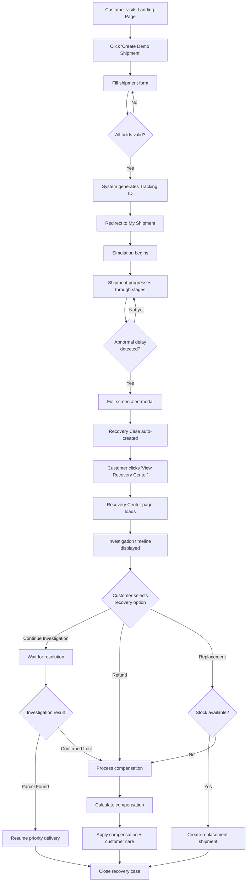
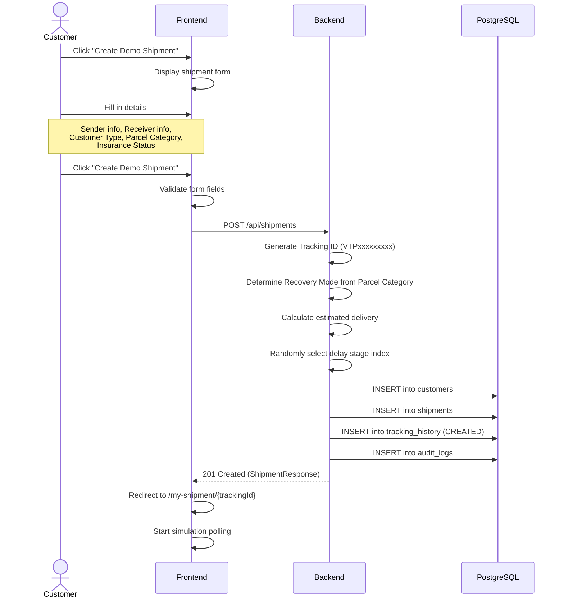
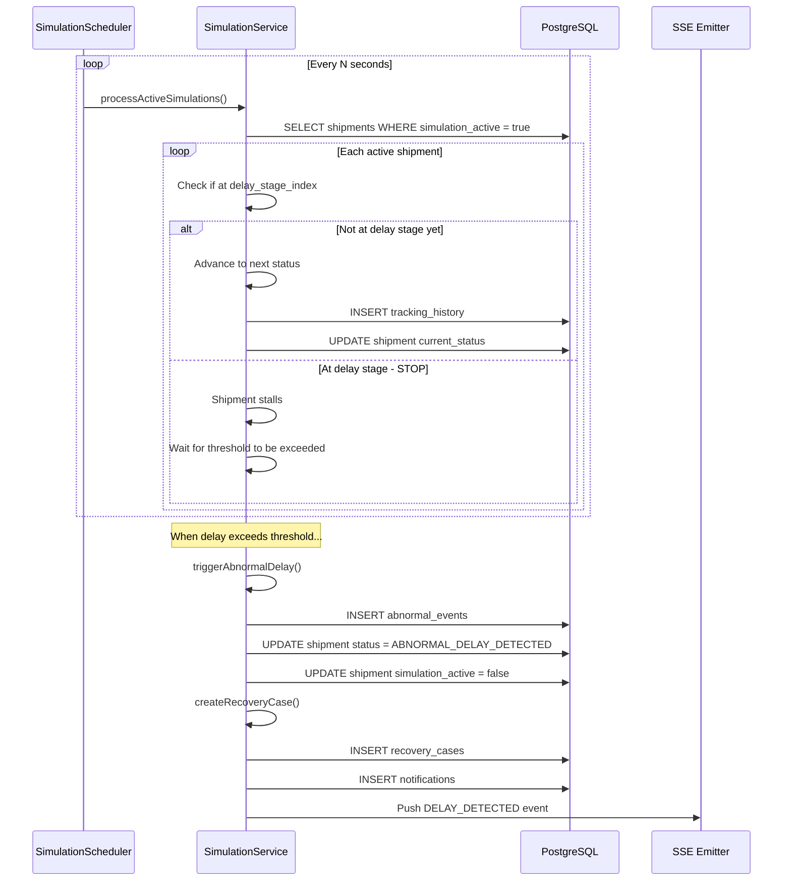
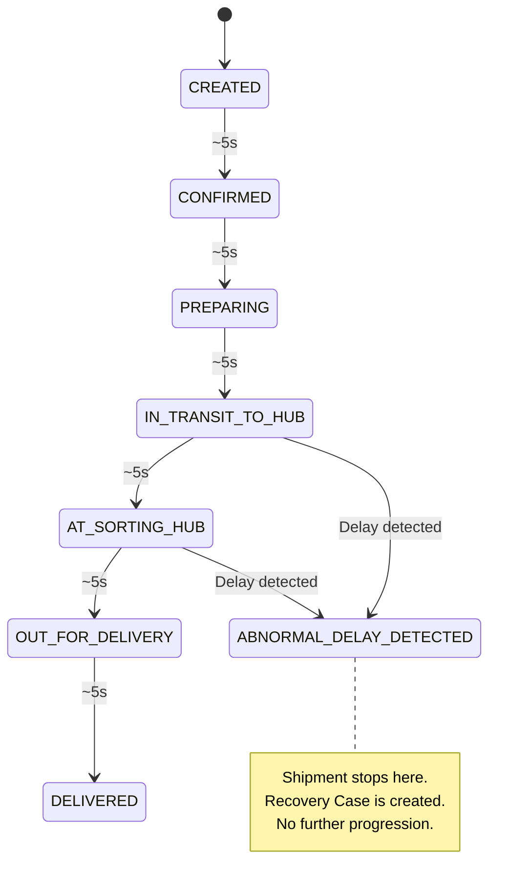
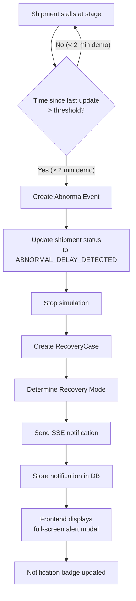
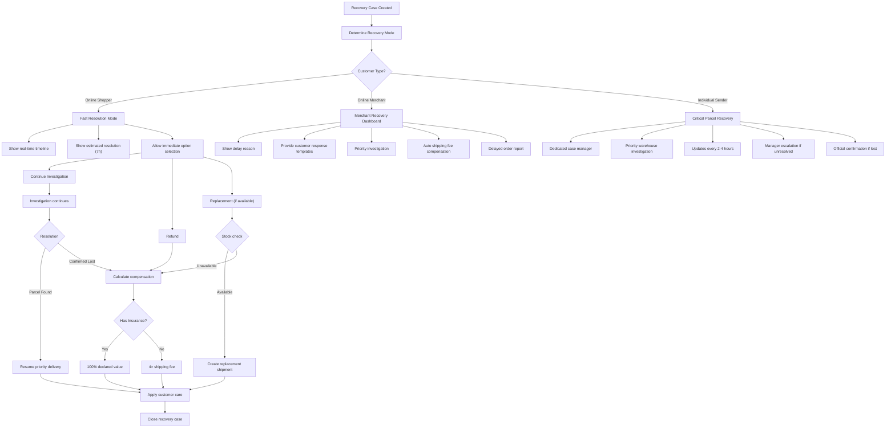
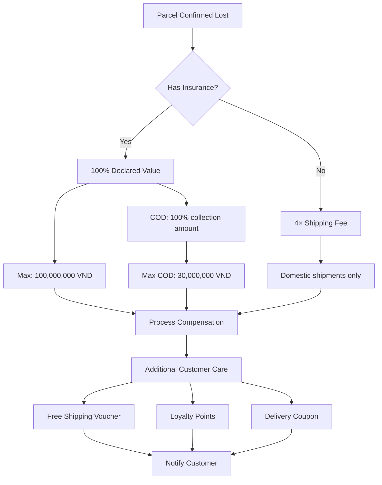
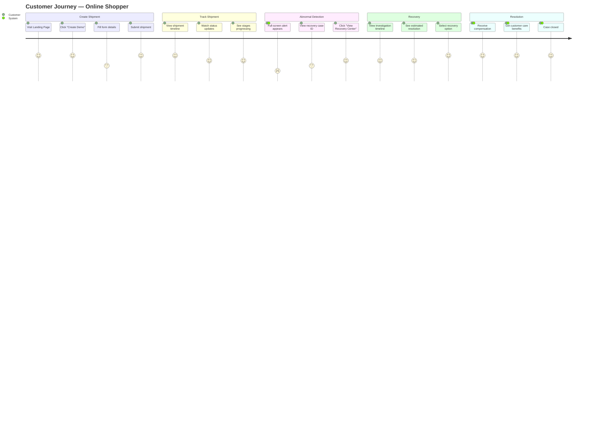

# Business Flow

## Overview

This document describes the complete business flows of the Smart Adaptive Recovery System (SARS), from shipment creation through abnormal detection to recovery resolution.

---

## Main Business Flow

---

## Flow 1: Shipment Creation

---

## Flow 2: Shipment Simulation

### Shipment Status Progression

---

## Flow 3: Abnormal Delay Detection

---

## Flow 4: Recovery Process

---

## Flow 5: Investigation Timeline

The investigation progresses through these stages automatically:

```mermaid
gantt
    title Investigation Timeline Progression
    dateFormat HH:mm
    section Investigation Steps
    Recovery Case Created           :done, a1, 00:00, 1min
    Warehouse Manager Notified      :done, a2, after a1, 2min
    Scanning Records Checked        :active, a3, after a2, 3min
    Storage Location Verified       :a4, after a3, 3min
    CCTV Review (if needed)         :a5, after a4, 5min
    Staff Handling History Reviewed  :a6, after a5, 3min
    Transportation Records Reviewed :a7, after a6, 3min
    Investigation Result            :milestone, after a7, 0min
```

---

## Flow 6: Compensation

### No Compensation Applies When:
- Damage caused by the sender
- Cannot prove shipment or damage
- Parcel delivered successfully without complaints
- Parcel confiscated or destroyed by law
- Complaint procedures not followed
- Force majeure events

---

## Flow 7: Customer Journey (End-to-End)

