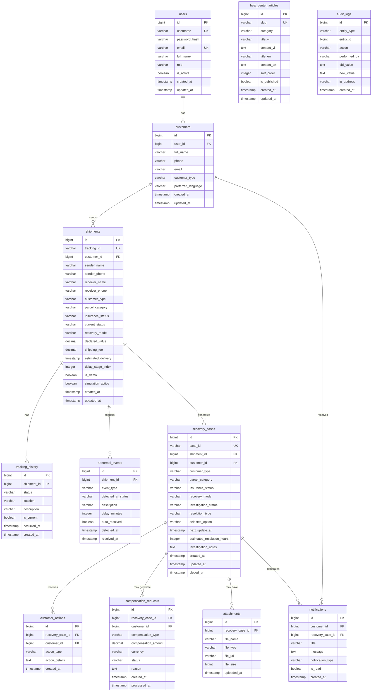

# Database Design

## Overview

PostgreSQL 16 with 12 core tables designed for production-readiness: proper primary keys, foreign keys, indexes, constraints, and audit support.

---

## Entity Relationship Diagram



---

## Table Descriptions

### 1. `users`

System users (admin accounts). Customers may optionally link to a user account.

| Column | Type | Constraints | Description |
|--------|------|-------------|-------------|
| `id` | `BIGSERIAL` | PK | Auto-increment primary key |
| `username` | `VARCHAR(50)` | UNIQUE, NOT NULL | Login username |
| `password_hash` | `VARCHAR(255)` | NOT NULL | BCrypt hashed password |
| `email` | `VARCHAR(100)` | UNIQUE | Email address |
| `full_name` | `VARCHAR(100)` | NOT NULL | Display name |
| `role` | `VARCHAR(20)` | NOT NULL, DEFAULT 'USER' | `ADMIN` or `USER` |
| `is_active` | `BOOLEAN` | DEFAULT true | Account active flag |
| `created_at` | `TIMESTAMPTZ` | DEFAULT NOW() | Creation timestamp |
| `updated_at` | `TIMESTAMPTZ` | DEFAULT NOW() | Last update timestamp |

---

### 2. `customers`

Customers who create demo shipments. May or may not have a linked user account.

| Column | Type | Constraints | Description |
|--------|------|-------------|-------------|
| `id` | `BIGSERIAL` | PK | Auto-increment primary key |
| `user_id` | `BIGINT` | FK → users(id), NULLABLE | Optional linked user account |
| `full_name` | `VARCHAR(100)` | NOT NULL | Customer name |
| `phone` | `VARCHAR(20)` | | Phone number |
| `email` | `VARCHAR(100)` | | Email address |
| `customer_type` | `VARCHAR(30)` | NOT NULL | `ONLINE_SHOPPER`, `ONLINE_MERCHANT`, `INDIVIDUAL_SENDER` |
| `preferred_language` | `VARCHAR(5)` | DEFAULT 'vi' | `vi` or `en` |
| `created_at` | `TIMESTAMPTZ` | DEFAULT NOW() | |
| `updated_at` | `TIMESTAMPTZ` | DEFAULT NOW() | |

**Indexes**: `idx_customers_user_id`, `idx_customers_customer_type`

---

### 3. `shipments`

Core shipment table. Each demo shipment has a unique tracking ID and progresses through delivery stages.

| Column | Type | Constraints | Description |
|--------|------|-------------|-------------|
| `id` | `BIGSERIAL` | PK | |
| `tracking_id` | `VARCHAR(20)` | UNIQUE, NOT NULL | Generated tracking ID (e.g., `VTP240719XXXXX`) |
| `customer_id` | `BIGINT` | FK → customers(id), NOT NULL | Owning customer |
| `sender_name` | `VARCHAR(100)` | NOT NULL | |
| `sender_phone` | `VARCHAR(20)` | NOT NULL | |
| `receiver_name` | `VARCHAR(100)` | NOT NULL | |
| `receiver_phone` | `VARCHAR(20)` | NOT NULL | |
| `customer_type` | `VARCHAR(30)` | NOT NULL | Denormalized for quick access |
| `parcel_category` | `VARCHAR(30)` | NOT NULL | `COMMERCIAL_GOODS`, `PERSONAL_ITEMS`, `IMPORTANT_DOCUMENTS`, `ONE_OF_A_KIND`, `FRAGILE` |
| `insurance_status` | `VARCHAR(15)` | NOT NULL | `INSURED` or `NOT_INSURED` |
| `current_status` | `VARCHAR(30)` | NOT NULL | Current shipment status |
| `recovery_mode` | `VARCHAR(30)` | NULLABLE | Determined by parcel category |
| `declared_value` | `DECIMAL(15,2)` | | Declared value of parcel |
| `shipping_fee` | `DECIMAL(10,2)` | | Shipping fee charged |
| `estimated_delivery` | `TIMESTAMPTZ` | | Estimated delivery time |
| `delay_stage_index` | `INTEGER` | | Stage index where delay is simulated |
| `is_demo` | `BOOLEAN` | DEFAULT true | Demo shipment flag |
| `simulation_active` | `BOOLEAN` | DEFAULT true | Whether simulation is running |
| `created_at` | `TIMESTAMPTZ` | DEFAULT NOW() | |
| `updated_at` | `TIMESTAMPTZ` | DEFAULT NOW() | |

**Indexes**: `idx_shipments_tracking_id`, `idx_shipments_customer_id`, `idx_shipments_status`, `idx_shipments_simulation`

---

### 4. `tracking_history`

Ordered history of shipment status changes.

| Column | Type | Constraints | Description |
|--------|------|-------------|-------------|
| `id` | `BIGSERIAL` | PK | |
| `shipment_id` | `BIGINT` | FK → shipments(id), NOT NULL | |
| `status` | `VARCHAR(30)` | NOT NULL | Status at this point |
| `location` | `VARCHAR(200)` | | Location description |
| `description` | `TEXT` | | Human-readable description |
| `is_current` | `BOOLEAN` | DEFAULT false | Is this the current stage |
| `occurred_at` | `TIMESTAMPTZ` | NOT NULL | When this status occurred |
| `created_at` | `TIMESTAMPTZ` | DEFAULT NOW() | |

**Indexes**: `idx_tracking_shipment_id`, `idx_tracking_occurred_at`

---

### 5. `abnormal_events`

Detected abnormal delays and incidents.

| Column | Type | Constraints | Description |
|--------|------|-------------|-------------|
| `id` | `BIGSERIAL` | PK | |
| `shipment_id` | `BIGINT` | FK → shipments(id), NOT NULL | |
| `event_type` | `VARCHAR(30)` | NOT NULL | `ABNORMAL_DELAY`, `LOST`, `DAMAGED` |
| `detected_at_status` | `VARCHAR(30)` | NOT NULL | Status when delay was detected |
| `description` | `TEXT` | | Details of the abnormality |
| `delay_minutes` | `INTEGER` | | How many minutes delayed |
| `auto_resolved` | `BOOLEAN` | DEFAULT false | Whether system auto-resolved |
| `detected_at` | `TIMESTAMPTZ` | NOT NULL | |
| `resolved_at` | `TIMESTAMPTZ` | NULLABLE | |

**Indexes**: `idx_abnormal_shipment_id`, `idx_abnormal_event_type`

---

### 6. `recovery_cases`

Recovery case lifecycle — from creation through investigation to resolution.

| Column | Type | Constraints | Description |
|--------|------|-------------|-------------|
| `id` | `BIGSERIAL` | PK | |
| `case_id` | `VARCHAR(20)` | UNIQUE, NOT NULL | Human-readable case ID (e.g., `RC240719XXXXX`) |
| `shipment_id` | `BIGINT` | FK → shipments(id), NOT NULL | |
| `customer_id` | `BIGINT` | FK → customers(id), NOT NULL | |
| `customer_type` | `VARCHAR(30)` | NOT NULL | |
| `parcel_category` | `VARCHAR(30)` | NOT NULL | |
| `insurance_status` | `VARCHAR(15)` | NOT NULL | |
| `recovery_mode` | `VARCHAR(30)` | NOT NULL | Determined by adaptive logic |
| `investigation_status` | `VARCHAR(30)` | NOT NULL, DEFAULT 'CREATED' | `CREATED`, `IN_PROGRESS`, `PARCEL_FOUND`, `CONFIRMED_LOST`, `CLOSED` |
| `resolution_type` | `VARCHAR(30)` | NULLABLE | `PARCEL_FOUND`, `CONFIRMED_LOST` |
| `selected_option` | `VARCHAR(30)` | NULLABLE | Customer's chosen option |
| `next_update_at` | `TIMESTAMPTZ` | | Estimated next update time |
| `estimated_resolution_hours` | `INTEGER` | DEFAULT 7 | |
| `investigation_notes` | `TEXT` | | Internal notes |
| `created_at` | `TIMESTAMPTZ` | DEFAULT NOW() | |
| `updated_at` | `TIMESTAMPTZ` | DEFAULT NOW() | |
| `closed_at` | `TIMESTAMPTZ` | NULLABLE | |

**Indexes**: `idx_recovery_case_id`, `idx_recovery_shipment_id`, `idx_recovery_status`

---

### 7. `notifications`

Notification history for customers.

| Column | Type | Constraints | Description |
|--------|------|-------------|-------------|
| `id` | `BIGSERIAL` | PK | |
| `customer_id` | `BIGINT` | FK → customers(id), NOT NULL | |
| `recovery_case_id` | `BIGINT` | FK → recovery_cases(id), NULLABLE | |
| `title` | `VARCHAR(200)` | NOT NULL | Notification title |
| `message` | `TEXT` | NOT NULL | Notification body |
| `notification_type` | `VARCHAR(30)` | NOT NULL | `DELAY_DETECTED`, `INVESTIGATION_UPDATE`, `RESOLUTION`, etc. |
| `is_read` | `BOOLEAN` | DEFAULT false | |
| `created_at` | `TIMESTAMPTZ` | DEFAULT NOW() | |

**Indexes**: `idx_notif_customer_id`, `idx_notif_read_status`

---

### 8. `customer_actions`

Actions taken by customers on recovery cases (e.g., selecting refund, replacement).

| Column | Type | Constraints | Description |
|--------|------|-------------|-------------|
| `id` | `BIGSERIAL` | PK | |
| `recovery_case_id` | `BIGINT` | FK → recovery_cases(id), NOT NULL | |
| `customer_id` | `BIGINT` | FK → customers(id), NOT NULL | |
| `action_type` | `VARCHAR(30)` | NOT NULL | `SELECT_CONTINUE`, `SELECT_REFUND`, `SELECT_REPLACEMENT`, `CONFIRM_CLOSE` |
| `action_details` | `TEXT` | | Additional details |
| `created_at` | `TIMESTAMPTZ` | DEFAULT NOW() | |

**Indexes**: `idx_customer_action_case_id`

---

### 9. `compensation_requests`

Compensation calculation and processing.

| Column | Type | Constraints | Description |
|--------|------|-------------|-------------|
| `id` | `BIGSERIAL` | PK | |
| `recovery_case_id` | `BIGINT` | FK → recovery_cases(id), NOT NULL | |
| `customer_id` | `BIGINT` | FK → customers(id), NOT NULL | |
| `compensation_type` | `VARCHAR(30)` | NOT NULL | `FULL_VALUE`, `SHIPPING_FEE_4X`, `VOUCHER`, `LOYALTY_POINTS` |
| `compensation_amount` | `DECIMAL(15,2)` | | Monetary amount |
| `currency` | `VARCHAR(5)` | DEFAULT 'VND' | |
| `status` | `VARCHAR(20)` | NOT NULL, DEFAULT 'PENDING' | `PENDING`, `APPROVED`, `PROCESSED` |
| `reason` | `TEXT` | | Reason/details |
| `created_at` | `TIMESTAMPTZ` | DEFAULT NOW() | |
| `processed_at` | `TIMESTAMPTZ` | NULLABLE | |

**Indexes**: `idx_compensation_case_id`, `idx_compensation_status`

---

### 10. `attachments`

File attachments for recovery cases (confirmation documents, reports).

| Column | Type | Constraints | Description |
|--------|------|-------------|-------------|
| `id` | `BIGSERIAL` | PK | |
| `recovery_case_id` | `BIGINT` | FK → recovery_cases(id), NOT NULL | |
| `file_name` | `VARCHAR(255)` | NOT NULL | |
| `file_type` | `VARCHAR(50)` | | MIME type |
| `file_url` | `VARCHAR(500)` | NOT NULL | |
| `file_size` | `BIGINT` | | File size in bytes |
| `uploaded_at` | `TIMESTAMPTZ` | DEFAULT NOW() | |

---

### 11. `help_center_articles`

Bilingual help center content.

| Column | Type | Constraints | Description |
|--------|------|-------------|-------------|
| `id` | `BIGSERIAL` | PK | |
| `slug` | `VARCHAR(100)` | UNIQUE, NOT NULL | URL-friendly identifier |
| `category` | `VARCHAR(50)` | NOT NULL | `FAQ`, `POLICY`, `GUIDE` |
| `title_vi` | `VARCHAR(200)` | NOT NULL | Vietnamese title |
| `content_vi` | `TEXT` | NOT NULL | Vietnamese content |
| `title_en` | `VARCHAR(200)` | NOT NULL | English title |
| `content_en` | `TEXT` | NOT NULL | English content |
| `sort_order` | `INTEGER` | DEFAULT 0 | Display order |
| `is_published` | `BOOLEAN` | DEFAULT true | |
| `created_at` | `TIMESTAMPTZ` | DEFAULT NOW() | |
| `updated_at` | `TIMESTAMPTZ` | DEFAULT NOW() | |

**Indexes**: `idx_help_slug`, `idx_help_category`

---

### 12. `audit_logs`

System-wide audit trail for all significant operations.

| Column | Type | Constraints | Description |
|--------|------|-------------|-------------|
| `id` | `BIGSERIAL` | PK | |
| `entity_type` | `VARCHAR(50)` | NOT NULL | `SHIPMENT`, `RECOVERY_CASE`, etc. |
| `entity_id` | `BIGINT` | NOT NULL | Referenced entity ID |
| `action` | `VARCHAR(50)` | NOT NULL | `CREATE`, `UPDATE`, `STATUS_CHANGE`, etc. |
| `performed_by` | `VARCHAR(100)` | | Who performed the action |
| `old_value` | `TEXT` | | Previous state (JSON) |
| `new_value` | `TEXT` | | New state (JSON) |
| `ip_address` | `VARCHAR(45)` | | Client IP address |
| `created_at` | `TIMESTAMPTZ` | DEFAULT NOW() | |

**Indexes**: `idx_audit_entity`, `idx_audit_created_at`

---

## Enum Values Reference

### ShipmentStatus
```
CREATED → CONFIRMED → PREPARING → IN_TRANSIT_TO_HUB → AT_SORTING_HUB → OUT_FOR_DELIVERY → DELIVERED
                                        ↓                     ↓
                              ABNORMAL_DELAY_DETECTED   ABNORMAL_DELAY_DETECTED
```

### CustomerType
| Value | Description |
|-------|-------------|
| `ONLINE_SHOPPER` | Online buyer — fast updates, refund/replacement |
| `ONLINE_MERCHANT` | Online seller — reputation protection, merchant dashboard |
| `INDIVIDUAL_SENDER` | Personal sender — personalized support, dedicated case manager |

### ParcelCategory
| Value | Recovery Mode |
|-------|---------------|
| `COMMERCIAL_GOODS` | Fast Replacement / Refund Support |
| `PERSONAL_ITEMS` | Standard Recovery |
| `IMPORTANT_DOCUMENTS` | Priority Recovery |
| `ONE_OF_A_KIND` | Intensive Search Mode |
| `FRAGILE` | Standard Recovery |

### InvestigationStatus
```
CREATED → IN_PROGRESS → PARCEL_FOUND → CLOSED
                       → CONFIRMED_LOST → CLOSED
```
