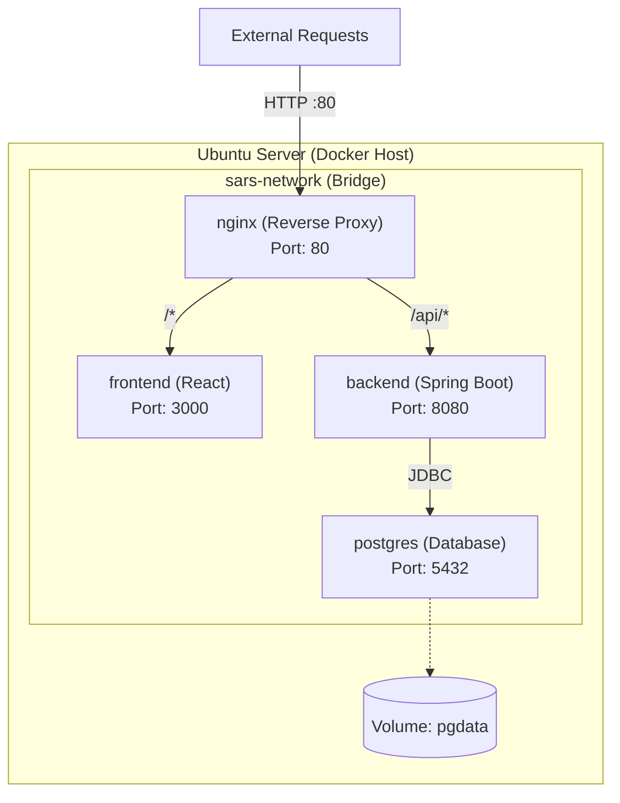

# Docker Architecture

## Overview
The Smart Adaptive Recovery System (SARS) is containerized using Docker and orchestrated with Docker Compose. This ensures a consistent environment across development, testing, and production on the Ubuntu 24.04 LTS server.

---

## Services Composition

The application consists of 4 Docker services defined in `docker-compose.yml`:

1. **`postgres`**: Database service
2. **`backend`**: Spring Boot REST API
3. **`frontend`**: React SPA (served via Nginx internally)
4. **`nginx`**: Reverse Proxy (API Gateway)

### Architecture Diagram

---

## Dockerfiles

### Backend (`/backend/Dockerfile`)
Uses a multi-stage build to compile the Java code and then run it in a lightweight JRE environment.
- **Build Stage**: `eclipse-temurin:21-jdk` (Maven build)
- **Run Stage**: `eclipse-temurin:21-jre-alpine`
- **Exposed Port**: 8080

### Frontend (`/frontend/Dockerfile`)
Uses a multi-stage build to compile the React app and serve static files.
- **Build Stage**: `node:22-alpine` (npm run build)
- **Run Stage**: `nginx:alpine`
- **Exposed Port**: 3000 (Internal Nginx serving the static files)

---

## Configuration Files

### `docker-compose.yml`
Orchestrates the services, network, and volumes.
- Defines a custom bridge network `sars-network`.
- Maps external port 80 to Nginx.
- Maps external port 5432 to Postgres for easy database inspection during development/demo.
- Mounts `/database/init.sql` and `/database/seed.sql` to Postgres `docker-entrypoint-initdb.d/` for auto-initialization.

### Nginx Reverse Proxy (`/nginx/default.conf`)
Acts as the main entry point, routing requests based on path.
- `/api/` -> routed to `backend:8080`
- `/` -> routed to `frontend:3000` (which serves the React static files)
- Configures proxy headers for SSE (Server-Sent Events) to work properly (`Connection: keep-alive`, `Cache-Control: no-cache`).

---

## Data Persistence
- **PostgreSQL Data**: A named volume `pgdata` is used to persist database state across container restarts.

## Networking
All services communicate over the internal `sars-network`. Services resolve each other using their service names defined in `docker-compose.yml` (e.g., the backend connects to `jdbc:postgresql://postgres:5432/sars_db`).
