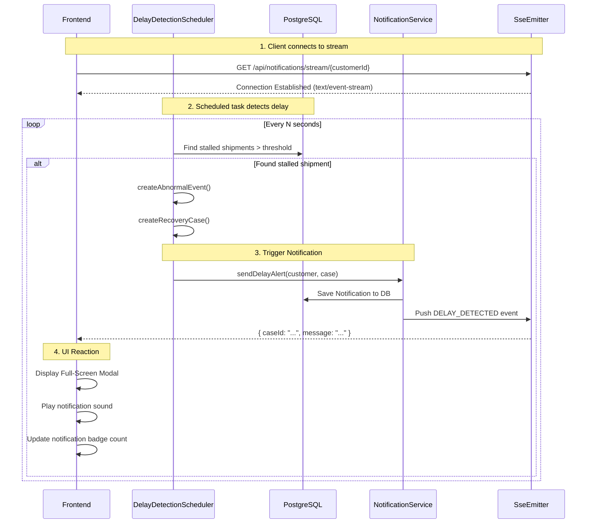

# Notification Flow

## Overview
The Smart Adaptive Recovery System (SARS) relies on proactive communication. When an abnormal delay is detected, the system immediately pushes a real-time notification to the user's browser using Server-Sent Events (SSE).

---

## Technical Implementation

### Server-Sent Events (SSE)
We use SSE instead of WebSockets because the communication is strictly one-way (Server to Client).
1. The Frontend establishes a connection to `/api/notifications/stream/{customerId}`.
2. The Backend holds the connection open and pushes events to it when they occur.
3. If the connection drops, the browser automatically attempts to reconnect.

---

## Abnormal Detection & Notification Flow

---

## Notification Types

The system supports several types of notifications pushed via SSE:

1. **`DELAY_DETECTED`**: Triggers the main full-screen alert modal.
2. **`INVESTIGATION_UPDATE`**: Silent update; adds to notification history and updates the timeline in the Recovery Center.
3. **`RESOLUTION_FOUND`**: Prominent alert; informs the user that the parcel was found or confirmed lost.
4. **`COMPENSATION_PROCESSED`**: Informs the user that refund/replacement has been processed.

---

## UI Components

### Full-Screen Alert Modal
When a `DELAY_DETECTED` event is received, a modal overlay covers the screen:
- **Title**: Abnormal Delay Detected
- **Content**: Explains the situation, provides the Recovery Case ID.
- **Action**: "View Recovery Center" button.
- **Audio**: A short, soft notification sound plays (optional based on browser auto-play policies).

### Notification Center (Bell Icon)
- Displays an unread badge count.
- Clicking opens a dropdown with the history of all received notifications.
- Clicking a notification marks it as read via `PATCH /api/notifications/{id}/read` and navigates to the relevant context.
