# Use Cases

## Actors

| Actor | Description |
|-------|-------------|
| **Customer** | End user who creates shipments and interacts with the recovery system |
| **Admin** | System administrator who monitors and manages operations |
| **System** | Backend simulation engine that automates shipment progression and delay detection |

---

## Use Case Diagram

```mermaid
graph TB
    subgraph Actors
        Customer["👤 Customer"]
        Admin["👨‍💼 Admin"]
        System["⚙️ System"]
    end

    subgraph UC_Shipment["Shipment Management"]
        UC1["UC-01: View Landing Page"]
        UC2["UC-02: Create Demo Shipment"]
        UC3["UC-03: Track Shipment"]
        UC4["UC-04: View Shipment History"]
    end

    subgraph UC_Recovery["Recovery Management"]
        UC5["UC-05: View Recovery Center"]
        UC6["UC-06: Select Recovery Option"]
        UC7["UC-07: View Investigation Timeline"]
        UC8["UC-08: Request Compensation"]
    end

    subgraph UC_Notification["Notifications"]
        UC9["UC-09: Receive Real-time Alert"]
        UC10["UC-10: View Notification History"]
    end

    subgraph UC_Help["Help Center"]
        UC11["UC-11: View Help Center"]
        UC12["UC-12: View Compensation Policy"]
    end

    subgraph UC_Admin["Admin Dashboard"]
        UC13["UC-13: View Dashboard Statistics"]
        UC14["UC-14: Manage Shipments"]
        UC15["UC-15: Manage Recovery Cases"]
        UC16["UC-16: View Audit Logs"]
    end

    subgraph UC_System["System Automation"]
        UC17["UC-17: Simulate Shipment Progression"]
        UC18["UC-18: Detect Abnormal Delay"]
        UC19["UC-19: Create Recovery Case"]
        UC20["UC-20: Send Notification"]
    end

    subgraph UC_I18n["Localization"]
        UC21["UC-21: Switch Language"]
    end

    Customer --> UC1
    Customer --> UC2
    Customer --> UC3
    Customer --> UC4
    Customer --> UC5
    Customer --> UC6
    Customer --> UC7
    Customer --> UC8
    Customer --> UC9
    Customer --> UC10
    Customer --> UC11
    Customer --> UC12
    Customer --> UC21

    Admin --> UC13
    Admin --> UC14
    Admin --> UC15
    Admin --> UC16

    System --> UC17
    System --> UC18
    System --> UC19
    System --> UC20
```

---

## Use Case Specifications

### UC-01: View Landing Page

| Field | Description |
|-------|-------------|
| **Actor** | Customer |
| **Precondition** | None |
| **Trigger** | Customer navigates to the website |
| **Main Flow** | 1. System displays landing page with hero banner 2. Customer sees SARS introduction, statistics, and "How it works" section 3. Customer can click "Create Demo Shipment" button |
| **Postcondition** | Landing page is displayed with all sections |
| **Alternative** | Customer navigates to other pages via navbar |

---

### UC-02: Create Demo Shipment

| Field | Description |
|-------|-------------|
| **Actor** | Customer |
| **Precondition** | Customer is on the Create Shipment page |
| **Trigger** | Customer clicks "Create Demo Shipment" button on landing page |
| **Main Flow** | 1. System displays shipment creation form 2. Customer enters sender information (name, phone) 3. Customer enters receiver information (name, phone) 4. Customer selects Customer Type (Online Shopper / Online Merchant / Individual Sender) 5. Customer selects Parcel Category (Commercial Goods / Personal Items / Important Documents / One-of-a-kind / Fragile) 6. Customer selects Insurance (Yes / No) 7. Customer clicks "Create Demo Shipment" 8. System validates all required fields 9. System generates unique Tracking ID 10. System creates shipment record and starts simulation 11. System redirects to My Shipment page |
| **Postcondition** | Shipment created, simulation started, customer redirected |
| **Validation** | All fields required except phone format validation (demo) |
| **Business Rule** | Recovery Mode is determined by Parcel Category selection |

---

### UC-03: Track Shipment

| Field | Description |
|-------|-------------|
| **Actor** | Customer, System |
| **Precondition** | Shipment has been created |
| **Trigger** | Customer views My Shipment page |
| **Main Flow** | 1. System displays shipment summary (tracking ID, customer type, parcel category, insurance, status) 2. System shows real-time shipment timeline 3. System simulates progression through stages every ~5 seconds 4. Customer watches statuses update in real-time 5. After ~30 seconds, shipment stalls at a random stage 6. When delay exceeds threshold (2 min demo), system detects abnormal delay 7. Full-screen alert modal appears 8. System creates Recovery Case automatically |
| **Postcondition** | Abnormal delay detected, recovery case created |
| **UI Requirement** | Full-screen modal, notification sound (optional) |

---

### UC-04: View Shipment History

| Field | Description |
|-------|-------------|
| **Actor** | Customer |
| **Precondition** | At least one shipment exists |
| **Main Flow** | 1. Customer navigates to shipment list 2. System displays all shipments with status indicators 3. Customer can click on a shipment to view details |

---

### UC-05: View Recovery Center

| Field | Description |
|-------|-------------|
| **Actor** | Customer |
| **Precondition** | Recovery case exists for the shipment |
| **Trigger** | Customer clicks "View Recovery Center" from alert or navigation |
| **Main Flow** | 1. System displays Recovery Summary (case ID, customer type, parcel category, insurance, recovery mode, investigation status) 2. System shows Investigation Timeline with chronological steps 3. System displays Notification Panel with all updates 4. System shows available recovery options based on customer type 5. System shows estimated resolution time (e.g., 7 hours) |
| **Postcondition** | Customer can see full recovery status and available options |

---

### UC-06: Select Recovery Option

| Field | Description |
|-------|-------------|
| **Actor** | Customer |
| **Precondition** | Recovery case is active, customer is viewing Recovery Center |
| **Trigger** | Customer clicks a recovery option button |
| **Main Flow** | See "Recovery Options by Customer Type" section below |
| **Business Rules** | Options vary by customer type. Replacement only for Online Shoppers. |

#### Recovery Options by Customer Type

**Online Shopper:**
- Continue Investigation
- Refund
- Replacement (if stock available)

**Online Merchant:**
- Priority Investigation
- Auto shipping fee compensation
- Customer response templates

**Individual Sender:**
- Dedicated case manager
- Priority investigation
- Manager escalation

---

### UC-07: View Investigation Timeline

| Field | Description |
|-------|-------------|
| **Actor** | Customer |
| **Precondition** | Recovery case exists |
| **Main Flow** | 1. System displays ordered investigation steps: &emsp;— Recovery Case Created &emsp;— Warehouse Manager Notified &emsp;— Scanning Records Checked &emsp;— Storage Location Verified &emsp;— CCTV Review (if needed) &emsp;— Staff Handling History Reviewed &emsp;— Transportation Records Reviewed &emsp;— Investigation Result 2. Each step shows completion status and timestamp 3. Active step is highlighted |

---

### UC-08: Request Compensation

| Field | Description |
|-------|-------------|
| **Actor** | Customer, System |
| **Precondition** | Parcel is confirmed lost OR customer selected refund |
| **Main Flow** | 1. System calculates compensation based on insurance status 2. **Insured**: 100% declared value (max 100M VND) 3. **Non-insured**: 4× shipping fee 4. System creates compensation request 5. System applies additional customer care (voucher, points, coupon) 6. Customer confirms and case is closed |

---

### UC-09: Receive Real-time Alert

| Field | Description |
|-------|-------------|
| **Actor** | Customer, System |
| **Precondition** | Shipment is being tracked |
| **Trigger** | Abnormal delay detected by system |
| **Main Flow** | 1. System sends SSE event 2. Frontend displays full-screen alert modal 3. Optional notification sound plays 4. Alert shows: title, message, Recovery Case ID 5. Customer clicks "View Recovery Center" |

---

### UC-10: View Notification History

| Field | Description |
|-------|-------------|
| **Actor** | Customer |
| **Main Flow** | 1. Customer clicks notification bell icon 2. System displays notification list in reverse chronological order 3. Unread notifications are highlighted 4. Customer can click to view related recovery case |

---

### UC-11: View Help Center

| Field | Description |
|-------|-------------|
| **Actor** | Customer |
| **Main Flow** | 1. Customer navigates to Help Center 2. System displays: &emsp;— Contact information (Hotline: 1900 1515, Email) &emsp;— Compensation policy &emsp;— FAQ &emsp;— Reference documents |

---

### UC-12: View Compensation Policy

| Field | Description |
|-------|-------------|
| **Actor** | Customer |
| **Main Flow** | 1. System displays insured vs non-insured compensation rates 2. System lists exclusion conditions |

---

### UC-13–16: Admin Dashboard Use Cases

| UC | Description |
|----|-------------|
| UC-13 | View real-time dashboard with shipment, recovery, notification, and customer statistics |
| UC-14 | Search, filter, and view all shipments with detailed status |
| UC-15 | Search, filter, and manage all recovery cases |
| UC-16 | View audit trail of all system operations |

---

### UC-17–20: System Automation Use Cases

| UC | Description |
|----|-------------|
| UC-17 | Automatically progress shipment through stages at configured intervals |
| UC-18 | Detect when a shipment has been stalled beyond the configured threshold |
| UC-19 | Automatically create recovery case with appropriate mode based on customer type × parcel category |
| UC-20 | Send SSE notification and persist notification record |

---

### UC-21: Switch Language

| Field | Description |
|-------|-------------|
| **Actor** | Customer |
| **Main Flow** | 1. Customer clicks VI/EN toggle in header 2. All UI text switches to selected language 3. Preference persisted in localStorage |
